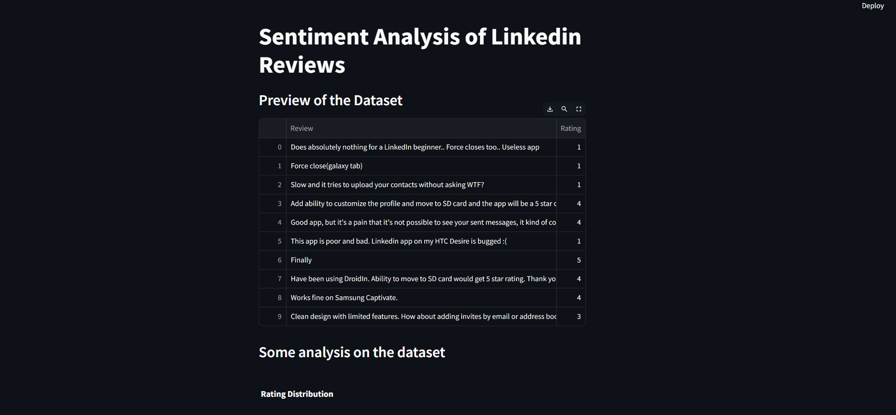
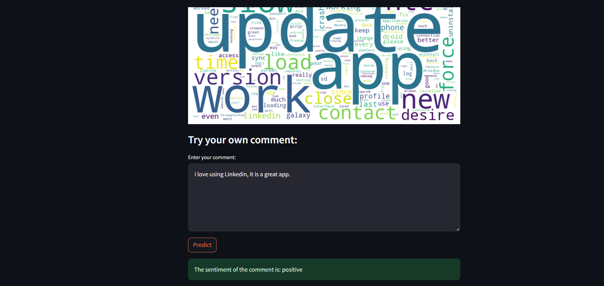
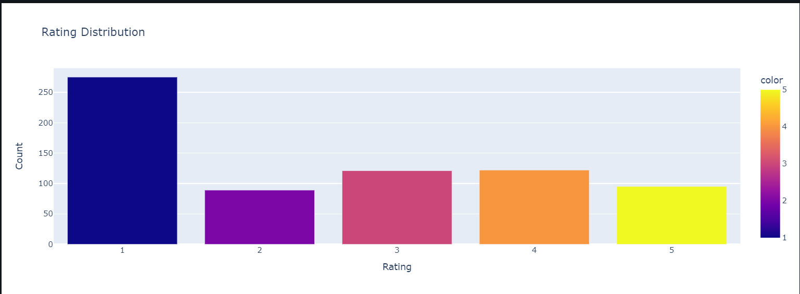
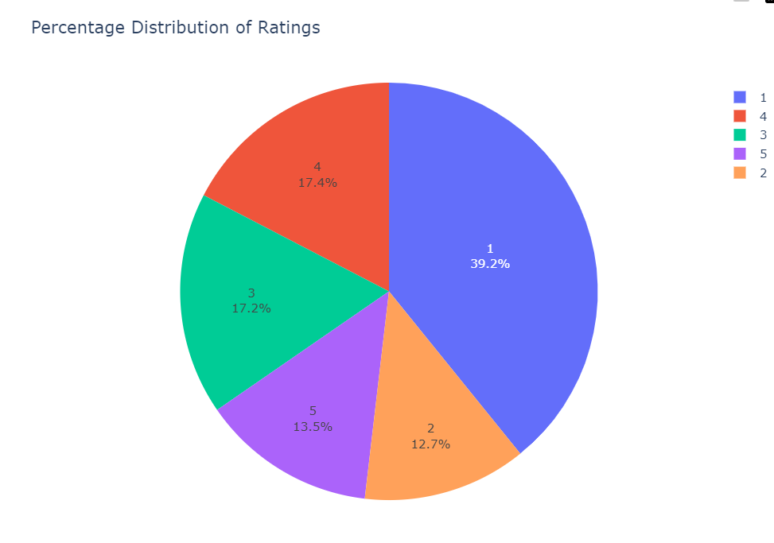
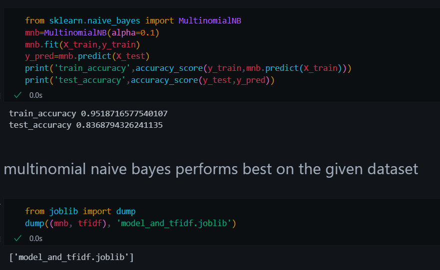

# LinkedIn Reviews Sentiment Analysis
You can access the running web app here: [LinkedIn Reviews Sentiment Analysis App](https://nikita320495-sentiment-analysis-app-4ghpu0.streamlit.app/)

## Overview

This project performs sentiment analysis on LinkedIn reviews to extract insights about user sentiment towards professionals, companies, or products. It utilizes natural language processing (NLP) techniques to preprocess text data, analyze sentiment polarity, and visualize key themes using word clouds.

## Features

- **Text Preprocessing**: Remove stopwords, punctuation, and perform tokenization.
- **Sentiment Analysis**: Analyze sentiment polarity (positive, negative)
- **Word Cloud Generation**: Visualize word frequencies to identify prominent topics in reviews.

## webapp interface

## Analysis on dataset

## Model Selection: Multinomial Naive Bayes

Among several classifiers tested for sentiment analysis on LinkedIn reviews, Multinomial Naive Bayes (MNB) demonstrated the highest test accuracy:

- **Multinomial Naive Bayes**:
  - Train Accuracy: 95.2%
  - Test Accuracy: 83.7%

### Reasons for Choosing Multinomial Naive Bayes:

1. **High Accuracy**: MNB achieved the highest test accuracy of 83.7%, indicating robust performance on unseen data.
   
2. **Suitability for Text Data**: MNB is well-suited for text classification tasks due to its effectiveness with high-dimensional data like word counts or TF-IDF values.

3. **Efficiency**: It is computationally efficient and scales well with large datasets, making it practical for processing a substantial volume of LinkedIn reviews.

### Conclusion:

Based on its strong performance and suitability for text classification, Multinomial Naive Bayes is selected as the optimal model for sentiment analysis of LinkedIn reviews in this project.
